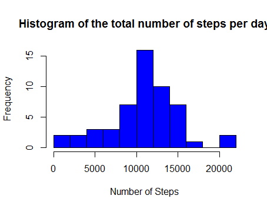
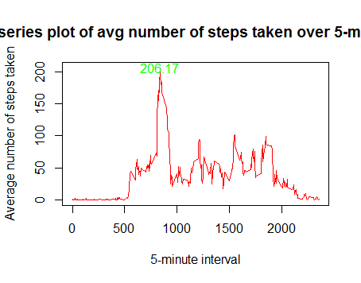
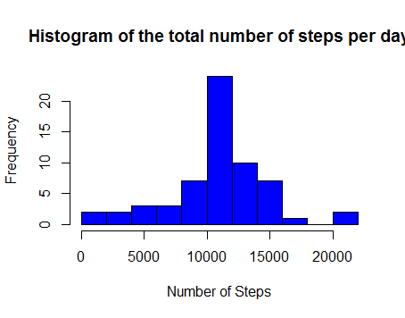
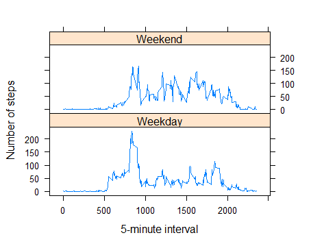

```{r setup, include=FALSE}
knitr::opts_chunk$set(echo = TRUE)
```


## Introduction

It is now possible to collect a large amount of data about personal movement using activity monitoring devices such as a Fitbit, Nike Fuelband, or Jawbone Up. These type of devices are part of the "quantified self" movement - a group of enthusiasts who take measurements about themselves regularly to improve their health, to find patterns in their behavior, or because they are tech geeks. But these data remain under-utilized both because the raw data are hard to obtain and there is a lack of statistical methods and software for processing and interpreting the data.


This assignment makes use of data from a personal activity monitoring device. This device collects data at 5 minute intervals through out the day. The data consists of two months of data from an anonymous individual collected during the months of October and November, 2012 and include the number of steps taken in 5 minute intervals each day.


## Data Source

The data for this assignment can be downloaded from the course web site:

Dataset: Activity monitoring data [52K]

The variables included in this dataset are:

- steps: Number of steps taking in a 5-minute interval (missing values are coded as NA)
- date: The date on which the measurement was taken in YYYY-MM-DD format
- interval: Identifier for the 5-minute interval in which measurement was taken

The dataset is stored in a comma-separated-value (CSV) file and there are a total of 17,568 observations in this dataset.


## Loading and preprocessing the data

First, I will create a folder for this course storage and also treat as the working folder for R programming. Then, it download the zip file through the internet and store in the specified folder which created before. Finally, I unzip and read into R program with table named "activity".

```{r}
# Create Project folder
if (!dir.exists("./reproducible-research")) dir.create("reproducible-research")
# Change working folder
if (dir.exists("reproducible-research")) setwd("./reproducible-research")

# Download & upzip source file
if(!file.exists("activity.csv")) { 
    ZipFile <- "./repdata.zip"
    if(!file.exists(ZipFile)) {
        ZipURL <- "https://d396qusza40orc.cloudfront.net/repdata%2Fdata%2Factivity.zip"
        download.file(url=ZipURL,destfile=ZipFile,method="auto")
    }  
    unzip(ZipFile) 
	if (file.exists("activity.csv")) file.remove("./repdata.zip")
}

# Read csv into R
activity <- read.csv("./activity.csv", header=TRUE, sep=",")

```


Find out the dimension of table "activity".

```{r, echo=TRUE}
dim(activity)
```


Check the column names oftable "activity".

```{r, echo=TRUE}
names(activity)
```


Scan the head & tail records oftable "activity".

```{r, echo=TRUE}
head(activity)
tail(activity)
```


Display the Structure of table "activity".

```{r, echo=TRUE}
str(activity)
```

After previous information, we know that the table "activity" has 17568 records, each record has 3 variables that two integer variables "steps" and "interval" and one factor variable "date". There are many "na" values in variable "steps" which would be include in my further study. 


Remove those incomplete records with "na" values and format the variable "date" as date format;

```{r, echo=TRUE}
activity$date <- as.Date(activity$date, "%Y-%m-%d")
```


## What is mean total number of steps taken per day?

Plot the histogram of the total number of steps taken each day.

```{r, echo=TRUE}
SumStepByDate <- aggregate(steps ~ date, data=activity, sum, na.action = na.omit)

hist(SumStepByDate$steps, breaks=10, col="blue", xlab="Number of Steps", main= "Histogram of the total number of steps per day")
```

 


Find the mean value of the total number of steps taken each day.

```{r, echo=TRUE}
MeanStep <- mean(SumStepByDate$steps, na.rm = TRUE)
print(MeanStep)
```

Find the median value of the total number of steps taken each day.

```{r, echo=TRUE}
MedianStep <- median(SumStepByDate$steps, na.rm = TRUE)
print(MedianStep)
```


## What is the average daily activity pattern?

Ploat a time series line chart forthe average number of steps taken

```{r, echo=TRUE}
MeanByTime <- aggregate(activity$steps ~ interval, data=activity, mean)
names(MeanByTime) <- c("interval","MeanStep")

MaxPonit <- MeanByTime[which.max(MeanByTime$MeanStep),]

plot(MeanByTime$MeanStep ~ as.numeric(MeanByTime$interval), type="l", xlab = "5-minute interval", ylab="Average number of steps taken", col="red", main="Time series plot of avg number of steps taken over 5-min interval")
text(x=MaxPonit$interval, y=MaxPonit$MeanStep,labels=round(MaxPonit$MeanStep,2), pch=11, col="green")
```

 


## Imputing missing values

```{r, echo=TRUE}
sum(is.na(activity$steps))
```
```{r, echo=TRUE}
sum(is.na(activity$date))
```
```{r, echo=TRUE}
sum(is.na(activity$interval))
```

The total number of missing values in the dataset is 2304 and all missing values in variable "steps".

Using the average number of steps taken every 5-minute interval fill in the missing step values in the orignal dataset and save in a new dataset.

```{r, echo=TRUE}
NewActivity <- activity

for (i in 1:nrow(NewActivity)) {
      if (is.na(NewActivity$steps[i])) {
            key <- NewActivity$interval[i]
            NewActivity$steps[i] <- as.integer(MeanByTime[which(MeanByTime$interval==key), 2])
      }
}

sum(is.na(NewActivity$steps))
```

Plot the histogram of total steps taken by day.

```{r, echo=TRUE}
NewSumStepByDate <- aggregate(steps ~ date, data=NewActivity, sum, na.action = na.omit)

hist(NewSumStepByDate$steps, breaks=10, col="blue", xlab="Number of Steps", main= "Histogram of the total number of steps per day")
```

 


Find the new mean value of the total number of steps taken each day.

```{r, echo=TRUE}
NewMeanStep <- mean(NewSumStepByDate$steps, na.rm = TRUE)
print(NewMeanStep)
```

Find the new median value of the total number of steps taken each day.

```{r, echo=TRUE}
NewMedianStep <- median(NewSumStepByDate$steps, na.rm = TRUE)
print(NewMedianStep)
```


```{r, echo=TRUE}
Weekend <- NewActivity[(weekdays(NewActivity$date) %in% c("Saturday", "Sunday")),]
Weekday <- NewActivity[!(weekdays(NewActivity$date) %in% c("Saturday", "Sunday")),]
```


## Are there differences in activity patterns between weekdays and weekends?

```{r, echo=TRUE}
WeekendMBT <- aggregate(Weekend$steps ~ interval, data=Weekend, mean)
names(WeekendMBT) <- c("interval","MeanStep")
WeekendMBT$Day <- "Weekend"
WeekdayMBT <- aggregate(Weekday$steps ~ interval, data=Weekday, mean)
names(WeekdayMBT) <- c("interval","MeanStep")
WeekdayMBT$Day <- "Weekday"

Both_MBT <- rbind(WeekendMBT, WeekdayMBT)

library(lattice)
xyplot(MeanStep ~ interval | Day, data=Both_MBT, layout=c(1, 2), type="l", xlab="5-minute interval", ylab="Number of steps")
	   
```

 

It can be observed that the average number of steps taken in weekday was more fluctuated than weeked.
